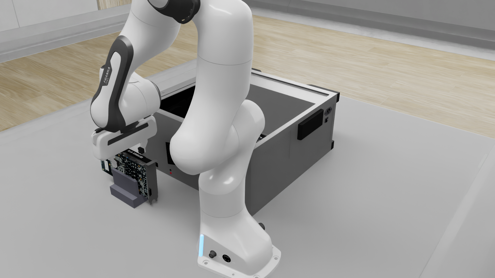
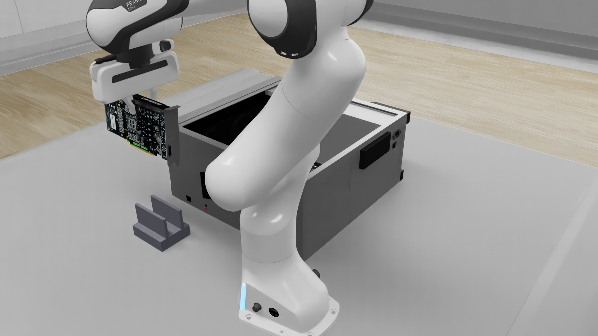

# Native-Resolution Integrated Grasp Continuation

**Latest physical result:** grasp/lift/carry and both standoffs passed, but the
one bounded plane-contact attempt stopped at the unchanged tracking guard1283.
Separate reviewed3cm withdrawal passed at1347; card remains visibly held.
Posthoc native success=false, score0.3333 (grasp credit, not seating). This
condition is CLOSED as negative, not pending another nearby camera/endpoint
sweep. Next is a separately labeled qualitative instruction-assisted condition.
Installation/release, task recovery and matched methods remain incomplete.
See `NATIVE_CONTACT_NEGATIVE_20260930.md` for exact receipts and limitations.

## Condition

Separate fresh1920x1080 RGB-D episode on8780:
`28eee6eaefa546529c9118f2aff58e25`. Existing held8772 remains protected.
Fresh Astra Flex medium chooses image pixels; legal measured depth supplies
surface points. The local differential-IK sequence is operator-defined.
Native grasp assistance is ON. External clearance is unknown/exploratory.
This is neither FLUX Hybrid nor an unassisted/real-hardware result.

## Evidence So Far

At235, a new Astra target selected right[1092,765], proposing aperture0.3 from
labeled retained aperture experience. The pixel itself passed local upward
plane qualification without refinement: upward cosine0.998927, RMS2.08e-8m,
depth spread1.129mm. No object-state query supplied target geometry.

Open-hand descent completed96 actions in three continuous local stages and
paused before closure at331. Final hand error0.225mm, rotation0.000310rad.
Wall time138.85s versus6.4s simulated time. The card remains on its support;
endpoint arrival is not grasp success.

Preclosure Astra review used three bounded current overviews plus one native
right-camera crop (original box[760,650,1500,1080], explicit pixel mapping).
It returned `inspect`: partial straddling evidence, uncertain longitudinal
centering and pad/support separation. No closure was sent. A single targeted
side-on camera hold was submitted, preserving arm pose/open aperture; gaze is
the earlier legal top-surface sample, not object truth. Camera geometry is
idealized and has no physical collision body. Results must be reviewed before
any grasp command, not treated as guaranteed visibility.

The sideview hold completed64 actions at395:1.25micrometre arm tracking error,
87.42s wall time. New eye[0.30,-0.68,0.32], gaze[0.274,-0.338,0.145]. The new
right-camera crop[360,460,1480,1060] retained native detail. Astra's changed-view
review resolved reasonable longitudinal centering and found no definite bracket
contact or specific misalignment; it still returned `inspect` because opposing
pad landing areas and support separation were unresolved. No closure/lift was
issued. **Do not continue a nearby camera/prompt sweep.** Higher resolution
improved readable evidence but did not remove this occlusion. The card remains
supported and the hand open at395; original held8772 is unchanged.

Three fresh Astra calls cost$0.10610125 total; cumulative reservation count4518,
shared ceiling$85 with existing unresolved holds unchanged. This negative visual
admission result is not a failed physical grasp and not a new completed phase.

## Software Correction

### Depth-Supported Contact Hypothesis

At395, three explicitly operator-selected current right-camera samples supplied
new metric evidence without another view. Support upper-face hypotheses at
[800,818] and[950,822] deprojected to world z0.085105m; their fitted normals were
nearly vertical, with sub-micrometre plane RMS in this idealized sensor. A visible
distal OUTER finger surface at[940,735] was z0.126537m. The nominal robot pinch
center was z0.129335m. Thus that visible finger sample is41.43mm above the sampled
support, and the nominal pinch44.23mm above it. These are surface-height
differences, NOT minimum clearance, calibrated uncertainty, full finger-volume
geometry or hidden inner-pad measurements. Operator labels remain hypotheses.

One fresh Astra review was given these raw samples plus an explicitly scoped
proposal: hold current hand pose, opening0.3, at most64 actions/15Hz, existing
10mm/0.10rad per-action tracking stop, no lift/transit/retry, assistance ON and
unknown external clearance. Astra corroborated the sample labels and returned
`close_candidate`. The earlier `inspect` was not edited or relabeled as approval;
this is new depth evidence AND a more explicitly bounded contact condition, so
it does not isolate the causal effect of depth alone. No strict safety gate was
relaxed. Cost$0.0455775; cumulative reservation count4519.

The separately executed closure completed64 actions at459, strict endpoint
arrival:0.423mm hand error/0.001127rad,90.01s wall time. Fresh images show narrowed
fingers around the card, without an obvious support strike. Capture remains
unverified from closure alone. A separate one-shot5cm upward diagnostic was
submitted with aperture0.3, tracking guard and declared10mm/0.15rad final motion
bounds; this does not authorize a carry or imply grasp success. No automatic
retry is allowed.

Short lift outcome at523:64 actions, raw reason `local stage budget ended without
arrival`,4.285mm final position error/0.002968rad. This passed the predeclared
exploratory motion bounds without a guard stop; raw precision nonarrival is
retained. Before/after visual review returned `partial_contact`: both card ends
rose and the card/finger relation was similar, but no definite gap from the
support's upper edge was visible. It is not yet a verified unsupported grasp.
Review cost$0.03747125; cumulative reservation count4520.

One new operator-defined upward extension was then declared from the CURRENT
523 hand pose:179mm up (approximately18cm), no lateral/reorientation/aperture
change, three continuous guarded stages/max192 actions, final endpoint motion
bounds10mm/0.03rad. This is a separate larger retention/clearance test, not a
retry to force the missed short-lift endpoint. No carry/contact with the case or
release is included.

The extension completed144 actions at667. Intermediate stages passed; final
receipt remained precision nonarrival at4.699mm/0.000181rad, inside the declared
lift-only bounds. Wall time208.07s versus9.6s simulated time. Fresh independent
operator review of left/right images shows the entire card above the now-empty
support, retained near its upper edge by the hand. This establishes assisted
grasp/lift for this episode, not stability under arbitrary manipulation.

Actual renderer evidence (no world model or generative enhancement):

Public evidence also retains the raw final receipt, three current depth samples
and the scoped contact review under `docs/evidence/native_grasp_lift_20260930`.
No evaluator/object pose or API credentials are included. The next action is one
arm-hold camera overview for destination targeting, not another grasp-view sweep.

Preclosure and lift review builders now reuse bounded overview encoding.
Preclosure uses native-coordinate declarations and supports explicitly mapped
sensor crops; old hardcoded640x360 language/full1920 API image payloads were
inconsistent with the new condition. No generated enhancement is used.
Tests cover640/1920 image bounds and coordinate/crop mapping; invalid crop
bounds fail before writing a request. These checks do not complete phases.
Review of a camera probe requires a matching completed open-hand hold receipt,
not an invented descent stage. Full CPU suite:398 passed.
New `prepare_grasp_contact_proposal.py` records operator sample hypotheses,
measured/rejected patches, hand-relative offsets and exact bounded proposal.
Stale inputs/invalid apertures fail; rejected depth never becomes free-space
evidence. It contains no simulator control or evaluator input.405 CPU tests pass;
new-script/test lint passes. These are component checks, not phase completion.

## Next Physical Milestones

### Destination Detail And Geometric Validation

An arm-hold destination overview completed at731, preserving the held card and
aperture. A correspondence review with only a native right-camera socket crop
returned `inspect`, with no resolved key or endpoints. At the SAME physical
state, adding a native left-camera connector crop returned
`correspondence_visible` and key visibility. This supports paired-detail
presentation, not a controlled resolution comparison or insertion success.

Three selected endpoints passed3x3 measured-depth validation: connector end_a
left[491,497], socket end_a right[1224,534], and socket end_b right[1031,521].
Connector end_b left[421,470] FAILED the depth-discontinuity check. Its center
ray hit the background table (world z0.000087m), with nearby optical depths
spanning1.18675-1.72628m. It must not be used to fit connector alignment.
Visual correspondence is therefore only partially geometrically validated.

A separate current-depth carry review selected valid center anchors at
left[450,474] and right[1110,528]. An elevated approximately43.9cm translation
was submitted with retained attitude/aperture and per-action tracking guards;
it does not use the rejected endpoint or include insertion, descent or release.
The carry completed328 actions at1059: all eight intermediate stages passed,
and final strict arrival passed at0.877mm/0.000427rad. This establishes hand
arrival only; fresh images must establish card retention and mating visibility.
Operator review of final left/right renderer images shows the card still
suspended above the motherboard; the right image exposes the gold connector
and socket region. This is visual retention evidence, not a validated alignment
or mating measurement. No insertion, descent or release occurred.

The working controller is an operator-defined sensor/local differential-IK
sequence with Astra review, NOT FLUX Hybrid or per-step GPT Direct. Idealized
camera geometry and native grasp assistance remain disclosed. Following the
external feedback, the next objective is one bounded serious insertion attempt
if geometry supports it, otherwise a clean negative and changed condition;
no further broad camera, prompt or aperture sweep is planned.

### Post-Carry Correspondence At1059

Fresh legal RGB-D retained the held pose at1059. The first right close-up
[980,100,1350,470] exposed the connector but cut off the historically selected
lower socket. Astra preserved the lower-socket identity, explicitly distinguished
the upper neighbor, and returned `inspect`. Correcting ONLY the sensor crop to
[800,100,1350,570] at the same physical state returned
`correspondence_visible`. This is a presentation correction, not a camera search
or proof that native resolution alone causes success.

All four new3x3 depth samples passed (unlike the rejected731 connector end_b).
Connector end_a/end_b right[1292,177]/[1052,162]; socket end_a/end_b
right[1223,531]/[1035,514]. Gold-surface sample span82.897mm versus socket-rim
span86.900mm, horizontal axis difference0.618degrees, corresponding-end
horizontal offsets7.722mm/5.920mm, minimum sampled vertical gap225.297mm.
Different surface definitions and finite image localization mean these values
are NOT insertion-fit tolerances. The internal socket key remains less clearly
resolved than the connector notch; socket rim is not the gap centerline.

One operator-scoped guarded10cm vertical exploratory standoff was submitted
using the existing measured-feature compiler: two continuous segments/max128
actions, measured attitude and aperture0.3 retained, nominal sampled gap at
least125mm. No insertion/contact/release or automatic retry is authorized by
this approach. It completed98 actions at1157: intermediate waypoint passed,
final strict arrival1.958mm/0.0000805rad,150.99s wall versus6.53s simulated.
The original SSH output stream stalled after the intermediate receipt; separate
read-only receipt/result inspection confirmed completion and no remaining
remote carry process. Only that stale LOCAL SSH process was terminated; the
worker was not restarted and the motion was not retried. Final renderer images
show the card still held above the motherboard. Fresh matching RGB-D was captured
for one native-detail gap review before any further descent.
The protected original8772 episode and unrelated CPU workload are untouched.

The five carry/correspondence reviews spanning731 and1059 cost$0.2286375;
cumulative reservation count4525. Shared$85 ceiling and unresolved holds remain
unchanged. Public reports exclude private API audit payloads and credentials.

The existing native-crop and earlier-target context are now available to the
observation-only socket-gap/centerline review paths as well as correspondence.
Previously those stages had only bounded overviews or could lose target identity.
No motion gate, depth qualification or evaluator boundary changed.

### Same-Socket Gap Evidence At1157

Native right crop[970,480,1280,570] plus731 target history produced
`rails_visible`: three rail pairs, with a possible key divider. Six center-ray
depth samples form consistent surface pairs8.329-8.790mm apart, nearly equal
heights. Their inferred midpoints lie around world y0.0294-0.0299m. They are
inferred channel hypotheses, not free-space or seating-depth measurements.

Sampling five evenly spaced pixel locations ACROSS each visually selected gap
showed essentially the same world height as the rims (approximately0.037566m;
one outer rail sample was0.177mm lower). Dark-gap center pixels exposed no
appreciable recess at these stations. The backend records raw sensor
`distance_to_image_plane`, not RGB-inferred depth. Texture-only detail, rendering
geometry or incorrect visual association are possible; this sensor evidence
does NOT prove collision geometry or absence of a cavity elsewhere. Do not
present an exploratory plane-contact test as verified keyed insertion.
Public audit: `evidence/native_grasp_lift_20260930/gap_depth_audit.json`.

Fresh correspondence review at1157 again identified both connector and socket
ends, all four3x3 depth measurements passed, and each corresponding horizontal
offset remained below10mm. Minimum sampled gap122.936mm. A separate guarded6cm
near-standoff was submitted: two continuous segments/max128actions, same
attitude/aperture, nominal remaining sampled gap62.936mm. No contact/release or
retry included. This advances the bounded physical attempt, not a new prompt
sweep or a matched-method success. The near-standoff completed84 actions at1241:
intermediate waypoint passed, final strict arrival1.223mm/0.000420rad,
127.03s wall versus5.6s simulated, no tracking stop. Fresh matching RGB-D and
retention/contact-proposal assessment are next. No contact, release or seating
success is established by these endpoint receipts.

Software checks:415 CPU tests pass. Native detail and historical target context
are tested for observation-only gap/centerline requests; tests do not complete
physical phases.

The two1157 reviews cost$0.1030175 total; cumulative reservation count4527.
No retry or new paid-provider route was used. Total of the seven reviews from
carry731 through correspondence1157 is$0.331655, not the full campaign spend.

1. Continue feature-relative carry/mating using fresh native
   sensor crops. Do not reuse held8772 coordinates or infer insertion from
   hand arrival. Preserve measured aperture and label idealized camera/grasp
   assistance. The fresh grasp/lift is achieved only in this assisted condition.
2. Independently verified insertion/release and recovery remain incomplete;
   matched Direct/FLUX comparison must use equal sensing/action semantics.

Relevant local artifacts: `runs/gpu1920_close_target`,
`runs/gpu1920_open_descent_20260930`, `runs/gpu1920_preclosure_review`, and
`runs/gpu1920_preclosure_sideview_20260930`. API audits/ledger remain private.
