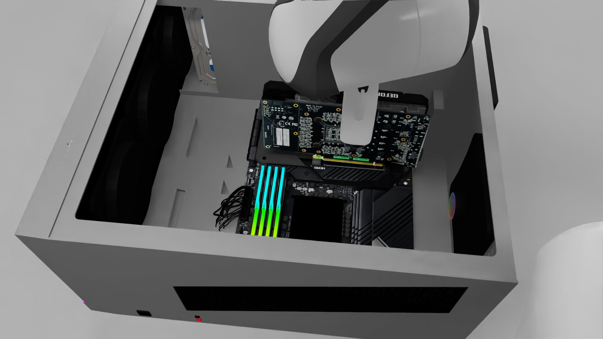
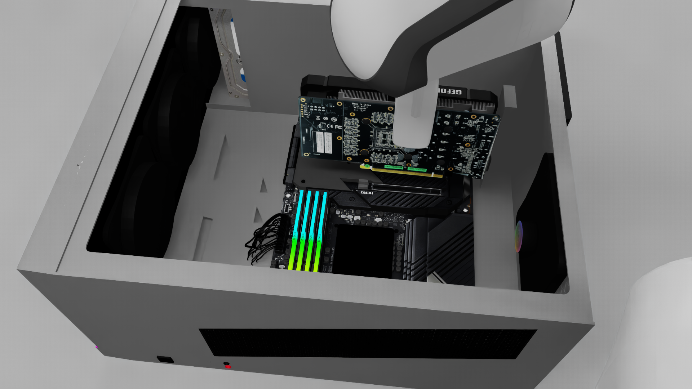

# Native-Resolution Contact Attempt: Negative Result

## Result

The one bounded serious plane-contact attempt stopped at the unchanged tracking
guard. A separate Astra-proposed3cm upward withdrawal passed. The card remains
visibly held; installation is NOT achieved. Posthoc native evaluation at1347:
`success=false`, score0.3333333433. This is latched grasp-milestone credit, not
partial seating or proof of current retention. Images supply retention evidence
separately. Scoring was not included in any planner request.

The attempt is closed. Do not retry descent, push through the guard, release the
card as if seated, or restart nearby camera/aperture/endpoint sweeps.

## Condition And Sequence

Worker8780, episode `28eee6eaefa546529c9118f2aff58e25`; native1920x1080 RGB-D,
idealized independent camera, native grasp assistance ON, unknown external
clearance. Astra Flex medium reviews sensor evidence; operator-defined local
continuous differential IK executes bounded stages. This is not FLUX Hybrid,
per-step GPT Direct, an unassisted grasp or a hardware-safety result.

At1241, fresh model-selected connector/socket endpoints all passed3x3 depth
qualification. Lowest gold sample z0.098699422m; highest sampled socket rim
z0.037566976m. Proposed descent61.132446mm, unchanged lateral pose, measured
attitude and aperture0.3, two segments/max128actions, no extra seating push,
release or automatic retry. Astra explicitly approved ONLY this exploratory
plane-contact hypothesis and retained uncertain gap/key/bracket clearance.

| Stage | End State | Actions | Raw Outcome |
| --- | --- | --- | --- |
| Contact intermediate |1262|21|Transit waypoint passed;3.316mm/0.008290rad tracking error|
| Contact final |1283|21|Contact tracking guard stopped;10.174mm/0.024181rad error|
| Reviewed3cm withdrawal |1347|64|Strict arrival;0.824mm/0.002138rad error|

Contact consumed42actions,2.8sim seconds/62.68wall seconds. Withdrawal consumed
64actions,4.27sim seconds/95.92wall seconds. No reset, guard bypass, extra push,
gripper release or contact retry occurred. The guard crossing was observed in a
native attempted interaction, not just a unit test; the exact collision or
constraint causing the tracking deviation remains unmeasured.

Visual monitoring occurs at returned stage boundaries, not continuously. The
worker monitors position/attitude tracking per action, not contact force. Do not
claim that every advisory visual stop condition was automatically monitored.

## What This Resolves

Native detail plus correctly scoped crops resolved visible endpoint and rail
association sufficiently to attempt contact. Higher resolution did NOT establish
an insertion channel: sampled dark-gap depth was essentially rim-height. The
bounded action then failed physically before its requested endpoint. The result
is not a successful insertion, not proof that a different model cannot solve it,
and not proof that one specific hidden body caused the stop.

The earlier evaluator-side `CONTACT_OBSERVABILITY_AUDIT_20260930.md` documented
an instruction mismatch and visual/collision representation differences. It is
context for experimental design, NOT motion-planner geometry. No source-derived
fixture coordinates, collision meshes, hidden object transforms, tolerances or
scores were supplied to this contact/recovery planner.

## Next Condition

### Instruction-Assisted Outcome: Branch Closed

The continuation below was performed, not left pending. At1347 Astra declined
motion and selected uncertain solid-surface anchors. One exterior oblique camera
hold completed64actions to1411, with0.715mm position and0.001572rad attitude
error. Arm and grip were retained. At1411 Astra again returned hold: actual I/O
bracket, matching expansion opening and passage were not established. No slide,
release, seating retry or further camera move followed.

Current legal surface samples put a sampled chassis rim44.877mm above a sampled
PCB reference. This is not full-object clearance or bracket identification.
The proposed12cm lift-to-expose was never executed and is cancelled: the bounded
focused geometry attempt is exhausted. These two assessment calls cost
$0.11904875 combined. The original benchmark remains incomplete, not impossible.

Next: [separate observable-fixture diagnostic](VISIBLE_FIXTURE_DIAGNOSTIC_PLAN_20260930.md).
The following instruction text records the completed changed-information condition.

Choose a separately labeled **qualitative instruction-assisted** continuation,
with this static instruction difference recorded:

> Before vertical seating, position the card's I/O bracket just forward of the
> rear panel, pass the bracket and ports through the expansion-slot cutout with
> a lateral slide, then align the PCB edge connector with the PCIe socket and
> press downward. Verify that the seated card remains supported after release.

This is adapted from the upstream qualitative assembly instruction, not a
source-derived trajectory or numerical fixture model. Do not dynamically call
`describe()`, pass task code/layout metadata, or feed invisible-fixture geometry
to the planner. Legal current RGB-D, robot FK and receipts remain its observations.
The added qualitative instruction is an explicit changed information contract,
NOT an unchanged minimal-input run or a matched causal resolution comparison.

The condition started from recovered1347 and ended held at1411. No supported
physical insertion stage emerged. An observable-fixture variant is a different
experiment, not a silent benchmark repair.

Full installation/release, task recovery and matched enhanced Direct/FLUX
comparisons remain incomplete. The protected original8772 episode and unrelated
CPU workload remain unchanged; no new worker/rental or system-driver modification.

## Software And Artifacts

The approach-review builder can now present the existing exact plane-contact
compiler, with native sensor crop and explicit non-insertion limits. The opt-in
contact executor requires a fresh affirmative contact review. Stale/denied
reviews are tested to stop before motion. The scene-level advisory review now
uses actual native pixel dimensions; its previous hardcoded640x360 instruction
was wrong for this condition. No controller/gate thresholds were relaxed.

The contact-review's exact stage JSON initially marked only the final segment
as guarded; this trial's explicit runner flag DID guard both segments. The
builder now mirrors that execution and the contact CLI requires the guard flag
for every segment. This repairs the review/executor contract, not a posthoc
change to the trial's stop thresholds. Original request/audit stays retained.

423 CPU tests passed. Focused new review lint passes except the existing
non-executable-shebang convention; full-repo lint cleanliness is not claimed.
Component checks are not physical phase completion.

Three fresh Astra reviews (1241 correspondence, exact contact proposal,1283
withdrawal assessment) cost$0.1592575. Cumulative reservation count4530; shared
$85 ceiling and all unresolved holds remain unchanged. No new route or retry.

Local retained runs: `gpu1920_contact1241_20260930`,
`gpu1920_contact1283_flat_20260930`, `gpu1920_withdraw1283_20260930` and
`gpu1920_withdraw1347_flat_20260930`. Public evidence retains the actual reviews,
receipts, current measured surfaces and posthoc evaluation separately from
controller inputs. Private API audit payloads/ledger/credentials are excluded.
